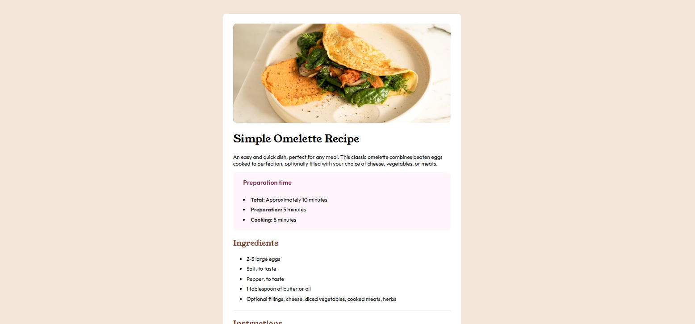

# Frontend Mentor - Recipe page solution

This is a solution to the [Recipe page challenge on Frontend Mentor](https://www.frontendmentor.io/challenges/recipe-page-KiTsR8QQKm). Frontend Mentor challenges help you improve your coding skills by building realistic projects. 

## Table of contents

  - [Links](#links)
  - [Screenshot](#screenshot)
  - [Built with](#built-with)
  - [What I learned](#what-i-learned)
  - [Useful resources](#useful-resources)
- [Author](#author)
- [Acknowledgments](#acknowledgments)


### Links


- Solution URL: [solution URL here](https://github.com/NITHISHKUMAR0283/recipe-page-)
- Live Site URL: [live site URL here](https://nithishkumar0283.github.io/recipe-page-/)


### Screenshot





### Built with

- Semantic HTML5 markup
- CSS custom properties


### What I learned

i learn how to add unordered and ordered list  how to create table and how to control the table border with css you can see below 

```html
<ul><li class="ele">2-3 large eggs</li>
    <li class="ele">Salt, to taste</li>
    <li class="ele">Pepper, to taste</li>
    <li class="ele">1 tablespoon of butter or oil</li>
    <li class="ele">Optional fillings: cheese, diced vegetables, cooked meats, herbs
</li></ul>
  
```
```css
.table td,.table th{
    color:hsl(14, 45%, 36%);
    font-weight: 700;
    padding:10px;
     border:none;
    border-bottom: 1px solid hsl(0, 0%, 89%);
}
```


## Acknowledgments

Thanks for checking out , you can solve the challenge by above links :)